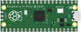
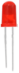
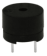
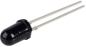
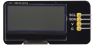

# **Keyestudio Raspberry Pi Pico Learning Kit Basic Edition**

### **Introduction**

Do you want to learn about programming?

As long as you are passionate about science and dare to explore new things, this kit is surely the best choice for you.

The kit is a learning kit for two programming methods, including Thonny, MicroPython IDE and Arduino IDE, you can create numerous fascinating experiments with the Raspberry pi, sensors, modules and electronic components. 

Tutorials are provided, which contain detailed wiring diagrams, component knowledge, test code, and so on. 

In addition, you can master the use of electronics, physics, science and programming by building up experiment with this kit.

### **Kit List**

|               NAME                |                             PIC                              | QTY  |
| :-------------------------------: | :----------------------------------------------------------: | :--: |
|         Raspberry Pi Pico         |  |  1   |
|             Blue LED              |  |  10  |
|              Red LED              |  |  10  |
|            Yellow LED             |  |  10  |
|             Green LED             |  |  10  |
|                RGB                |  |  1   |
|           220Ω Resistor           |  |  10  |
|           10KΩ Resistor           |  |  10  |
|           1KΩ Resistor            |  |  10  |
| Raspberry Pi Pico Expansion Board |  |  1   |
|        10KΩ Potentiometer         |  |  1   |
|           Active Buzzer           |  |  1   |
|          Passive Buzzer           |  |  1   |
|              Button               |  |  4   |
|            Tilt Switch            |  |  1   |
|           Photoresistor           |  |  1   |
|             Blue Cap              |  |  2   |
|            Yellow Cap             |  |  2   |
|            IC 74HC595N            |  |  1   |
|           Flame Sensor            |  |  1   |
|       1-Digit Tube Display        |  |  1   |
|       4-Digit Tube Display        |  |  1   |
|      8*8 Dot Matrix Display       |  |  1   |
|           S8050 Triode            |  |  2   |
|          LCD_128X32_DOT           |  |  1   |
|          10K Thermistor           |  |  1   |
|                Fan                |  |  1   |
|             DC Motor              |  |  1   |
|          Breadboard Wire          |  |  30  |
|             White LED             |  |  10  |
|       10CM M-F Dupont Wire        |  |  10  |
|             USB Cable             |  |  1   |
|               Diode               |  |  1   |
|          Resistance Card          |  |  1   |
|            Breadboard             |  |  1   |
|           S8550 Triode            |  |  2   |

### **Catalogue:**

| PROJECT     |                         |
| ----------- | ----------------------- |
| Project 01: | Hello World             |
| Project 02: | Onboard LED flashing    |
| Project 03: | External LED flashing   |
| Project 04: | Breathing Led           |
| Project 05: | Traffic Lights          |
| Project 06: | RGB LED                 |
| Project 07: | Flowing Water Light     |
| Project 08: | 1-Digit Digital Tube    |
| Project 09: | 4-Digit Digital Tube    |
| Project 10: | 8×8 Dot-matrix Display  |
| Project 11: | 74HC595N Control 8 LEDs |
| Project 12: | Active Buzzer           |
| Project 13: | Passive Buzzer          |
| Project 14: | Mini Table Lamp         |
| Project 15: | Tilt And LED            |
| Project 16: | I2C 128×32 LCD          |
| Project 17: | Small Fan               |
| Project 18: | Dimming Light           |
| Project 19: | Flame Alarm             |
| Project 20: | Night Lamp              |
| Project 21: | Temperature Instrument  |
