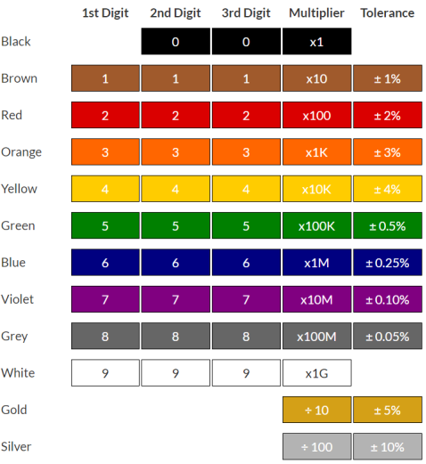

# Project 03：External LED Flashing 

### **1. Description**

There is an onboard LED in Raspberry Pi Pico,which is a GP25 pin attached to the Raspberry Pi Pico. In this project, we will learn the effect of making the onboard LED blink.

### **2. Components**

|  |  |
| :-----------------------------------------------------: | :----------------------------------: |
| Raspberry Pi Pico\*1                                    | Raspberry Pi Pico Expansion Board\*1 |
|  |  |
| USB Cable\*1 | Breadboard\*1 |
|  ||
| Red LED\*1                                             | 220Ω Resistor\*1                     |
|  |  |
| Jumper Wire\*2 |  |

### **3.Component Knowledge**

**LED:**


It is a kind of semiconductor called "light-emitting diode", which is an electronic device made of semiconductor materials (silicon, selenium, germanium, etc.). It has an anode and a cathode. The short lead (cathode) is grounded. The long lead (anode)is connected to 5V. 


**Resistor**

A resistor is an electronic component in a circuit that restricts or regulates the flow current flow. Its unit is(Ω). 1 mΩ= 1000 kΩ，1kΩ= 1000Ω.


We can use resistors to protect sensitive components, such as LEDs. The strength of the resistance is marked on the body of the resistor with an electronic color code. Each color code represents a number, and you can refer to it in a resistance card.



In this kit, we provide eight 5-band resistors with different resistance values. Take three 5-band resistors as an example.

220Ω resistor\*10


10KΩ resistor\*10


1KΩ resistor\*10


The connection between current, voltage, and resistance can be expressed by the formula: I=U/R.In the figure below, if the voltage is 3V, the current through R1 is: I = U / R = 3 V / 10 KΩ= 0.0003A= 0.3mA.


**Breadboard**

A breadboard is used to build and test circuits quickly before finalizing any circuit design. The breadboard has many holes into which circuit components like integrated circuits and resistors can be inserted. A typical breadboard is as follows.


The bread board has strips of metal which run underneath the board and connect the holes on the top of the board. The metal strips are laid out as shown below. Note that the top and bottom rows of holes are connected horizontally while the remaining holes are connected vertically.


The first two rows (top) and the last two rows (bottom) of the breadboard are used for the positive (+) and negative (-) terminals of the power supply, respectively. The conductive layout of the breadboard is shown in the following diagram.


When we connect DIP (Dual In-line Packages) components, such as integrated circuits, microcontrollers, chips and so on, we can see that a groove in the middle isolates the middle part, so the top and bottom of the groove is not connected. DIP components can be connected as shown in the figure below.


### **4. Circuit Diagram and Wiring Diagram**

**How to use the keyestudio raspberry pico expansion board**

Stack the pico board onto the expansion board, as shown below;


Interface the pico board with your computer with a USB cable.


**Circuit Diagram**

Note: Cut off the pico board. Build up the circuit according to the circuit and wiring diagram.

Make sure the circuit is correct then connect the pico board to the computer.

Note: Avoid any possible short circuits (especially connecting 3.3V and GND)\!

Warning: A short circuit may cause a large current in the circuit, causing components to overheat and permanent damage to the hardware.


**Wiring Diagram**


Note:

How to connect an LED


How to identify the 220Ω five-band resistor


### **5. Test Code：**

According to the circuit diagram, when Pico's GP16 outputs a high level, the LED will light up; when it outputs a low level, the LED light will be off. Therefore, we can make the LED flash repeatedly by controlling the GP16 to output high and low levels.

You can open the code we provide:

Go to the folder KS3026 Keyestudio Raspberry Pi Pico Learning Kit Basic Edition\2. Windows  System\2. C_Tutorial\2. Projects\Project 03：External LED flashing\Project_03_External_LED_Flashing.

```c
//**********************************************************************
/*
 * Filename    : External LED flashing
 * Description : Make an led blinking.
 * Auther      : http//www.keyestudio.com
*/
#define PIN_LED   16   //define the led pin

// the setup function runs once when you press reset or power the board
void setup() {
  // initialize digital pin LED as an output.
  pinMode(PIN_LED, OUTPUT);
}

// the loop function runs over and over again forever
void loop() {
  digitalWrite(PIN_LED, HIGH);   // turn the LED on (HIGH is the voltage level)
  delay(500);                       // wait for 0.5s
  digitalWrite(PIN_LED, LOW);    // turn the LED off by making the voltage LOW
  delay(500);                       // wait for 0.5s
}
//*************************************************************************************
```


Before uploading Test Code to Raspberry Pi Pico, please check the configuration of Arduino IDE.

Click "Tools" to confirm that the board type and ports.


Click  to upload the test code to the Raspberry Pi Pico board.


### **6. Test Result**

After the project code was uploaded successfully, the LED started flashing.


