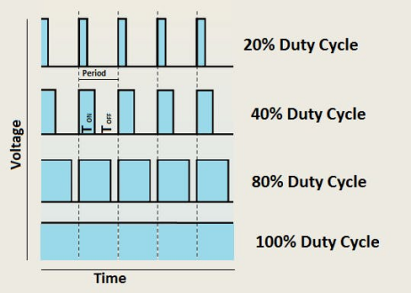

# Project 04: Breathing Led

### **1.Introduction**

In this project, we will learn the PWM control of ARDUINO. PWM is Pulse Width Modulation, which is a technique that encodes analog signal levels into digital signal levels. We will use PWM to control the brightness of LED.

### **2.Components**

|  |  |  |  |
| ------------------------------------------------------- | ------------------------------------ | ---------------------- | ---------------------- |
| Raspberry Pi Pico\*1                                    | Raspberry Pi Pico Expansion Board\*1 | USB Cable\*1 | Jumper Wire\*2 |
|  ||||
| Red LED\*1                                              | 220Ω Resistor\*1                     | Breadboard\*1          |          |

### **3.Component Knowledge**


**Working principle**

It can control the brightness of LED, the speed of DC motors and Servo motors, and outputs square wave signal. If we want to dim the LED,  we can change the ON(open) and OFF(close) time of the signal. When we change the time of ON and OFF fast enough, then the brightness of the LED will change. Here are some terms related to PWM as follows.

**ON (open)**：When the signal is high.

**OFF (close)**：When the signal is low.

Period: It is the sum of the time of On and Off.

Duty cycle: The percentage of time when the signal is at a high level for a certain period of time. At 50% duty cycle and 1Hz frequency, the LED will be on for half a second and off for the other half of a second. 



**Arduino and PWM**

The Arduino IDE has a built-in function“analogWrite()”that can be used to generate PWM signals. Most of the pins generate signals with a frequency of about 490Hz and we can use this function to give values from 0 to 255.

“analogWrite(0)” indicates a signal with 0% duty cycle. “analogWrite(127)” indicates a signal with 50% duty cycle. “analogWrite(255)” indicates a signal with 100% duty cycle. On the Plus control board, the PWM pins are 3, 5, 6, 9, 10, and 11. PWM pins are marked with the “~”symbol. In this project, you will learn how to get the PWM output from the digital pins of the Plus control board and control the brightness of the LED by code.

### **4. Circuit Diagram and Wiring Diagram**


**Note:**

How to connect the LED


How to identify the 220Ω 5-band resistor


### **5.Test Code**

The design of this project makes GP16 output PWM, and the pulse width gradually increases from 0% to 100%, and then gradually decreases from 100% to 0%.

You can open the code we provide:

Go to the folder KS3026 Keyestudio Raspberry Pi Pico Learning Kit Basic Edition\2. Windows  System\2. C_Tutorial\2. Projects\Project 04：Breathing Led\Project_04_Breathing_Led.

```c
//**********************************************************************
/*
 * Filename    : Breathing Led
 * Description : Make led light fade in and out, just like breathing.
 * Auther      : http//www.keyestudio.com
*/
#define PIN_LED   16   //define the led pin

void setup() {
  pinMode(PIN_LED, OUTPUT);
}

void loop() {
  for (int i = 0; i < 255; i++) { //make light fade in
    analogWrite(PIN_LED, i);
    delay(5);
  }
  for (int i = 255; i > -1; i--) {  //make light fade out
    analogWrite(PIN_LED, i);
    delay(5);
  }
}
//**********************************************************************
```


Before uploading Test Code to Raspberry Pi Pico, please check the configuration of Arduino IDE.

Click "Tools" to confirm that the board type and ports.


Click  to upload the test code to the Raspberry Pi Pico board.


### **6.Test Result**

After burning the project code, connecting the wires according to the wiring diagram, and powering on, the LED lights up gradually, and then gradually darkens.


