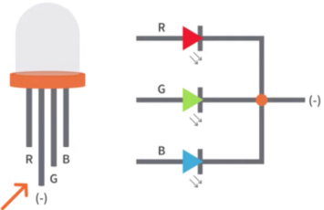
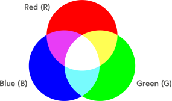
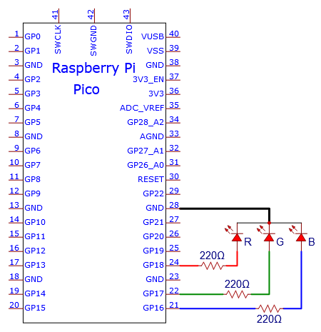
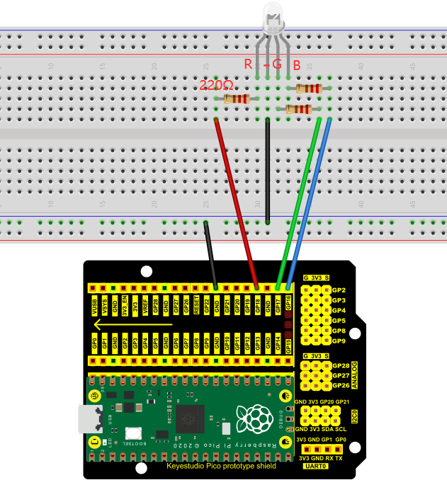
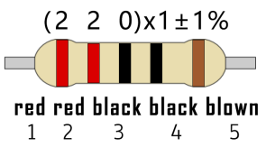
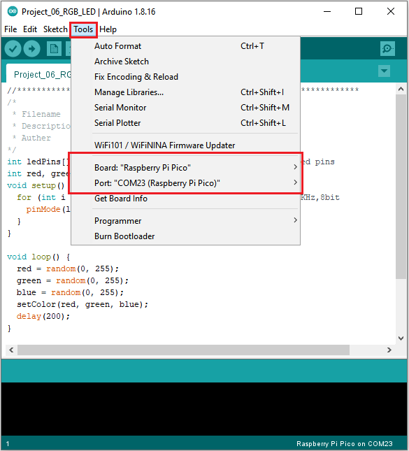
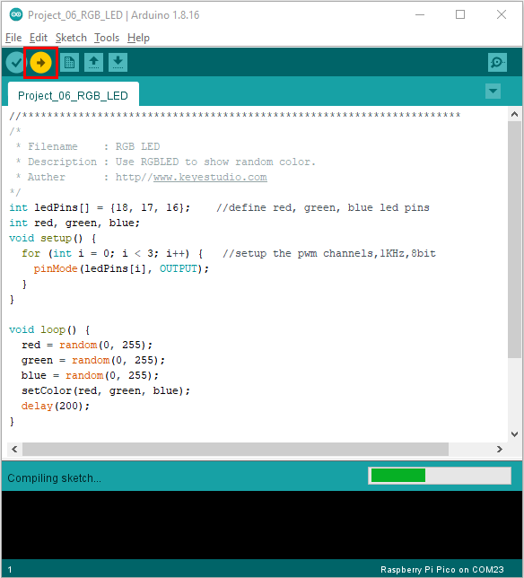
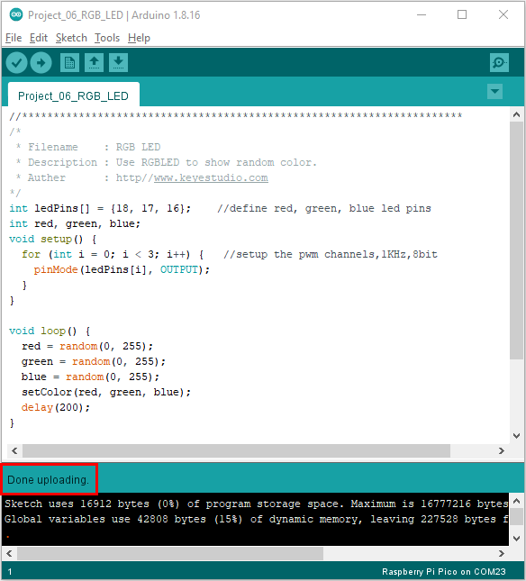

# Project 06: RGB LED

### **1. Introduction**


In this project, we will introduce the RGB LED and show you how to use the Plus control board to control the RGB LED. Even though RGB LED is very basic, it is also a great way to learn the fundamentals of electronics and coding.

### **2.Components Required**

|  |  |  |
| ------------------------------------------------------------ | ------------------------------------------------------------ | ------------------------------------------------------------ |
| Raspberry Pi Pico*1                                          | Raspberry Pi Pico Expansion Board*1                          | RGB LED*1                                                    |
|  |  |  |
| 220Ω Resistor*3                                              | Breadboard*1                                                 | Jumper Wires                                                 |
|  |                                                              |                                                              |
| USB Cable*1                                                  |                                                              |                                                              |

### **3. Component Knowledge**

**RGB LED：**

 

The monitors mostly adopt the RGB color standard, and all the colors on the computer screen are composed of the three colors of red, green and blue mixed in different proportions. 





This RGB LED has pin R, G and B and a common cathode. To change its brightness, we can use the PWM pins which can give different duty cycle signals to the RGB LED to produce different colors.

### **4.Circuit Diagram and Wiring Diagram**





**Note:**

RGB LED longest pin (common cathode) connected to GND.


How to identify the 220Ω 5-band resistor



### **5.Test Code**

We need to create three PWM channels and use random duty cycles to light up the RGB LEDs randomly.

You can open the code we provide:

Go to the folder KS3026 Keyestudio Raspberry Pi Pico Learning Kit Basic Edition\2. Windows  System\2. C_Tutorial\2. Projects\Project 06：RGB LED\Project_06_RGB_LED.

```c
//**********************************************************************
/*
 * Filename    : RGB LED
 * Description : Use RGBLED to show random color.
 * Auther      : http//www.keyestudio.com
*/
int ledPins[] = {18, 17, 16};    //define red, green, blue led pins
int red, green, blue;
void setup() {
  for (int i = 0; i < 3; i++) {   //setup the pwm channels,1KHz,8bit
    pinMode(ledPins[i], OUTPUT);
  }
}

void loop() {
  red = random(0, 255);
  green = random(0, 255);
  blue = random(0, 255);
  setColor(red, green, blue);
  delay(1000);
}

void setColor(byte r, byte g, byte b) {
  analogWrite(ledPins[0], 255-r); //Common cathode LED, high level to turn on the led.
  analogWrite(ledPins[1], 255-g);
  analogWrite(ledPins[2], 255-b);
}
//*********************************************************************************
```


Before uploading Test Code to Raspberry Pi Pico, please check the configuration of Arduino IDE.

Click "Tools" to confirm that the board type and ports.



Click  to upload the test code to the Raspberry Pi Pico board.





### **6.Test Result**

Upload the project code, wire up, power up and wait a few seconds, the RGB will show random colors.
