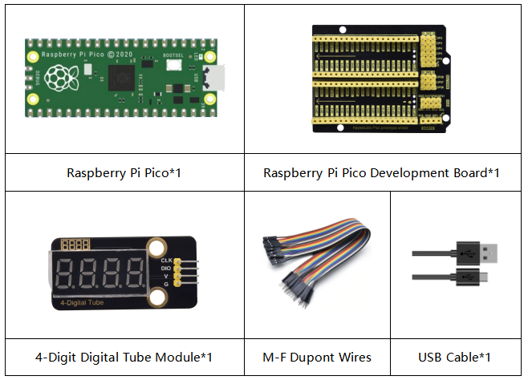
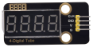
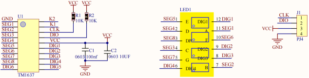
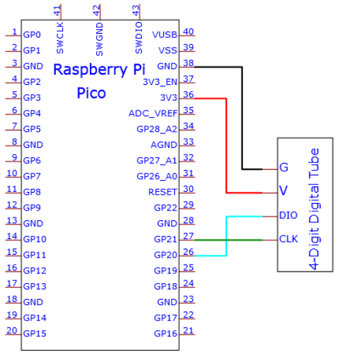
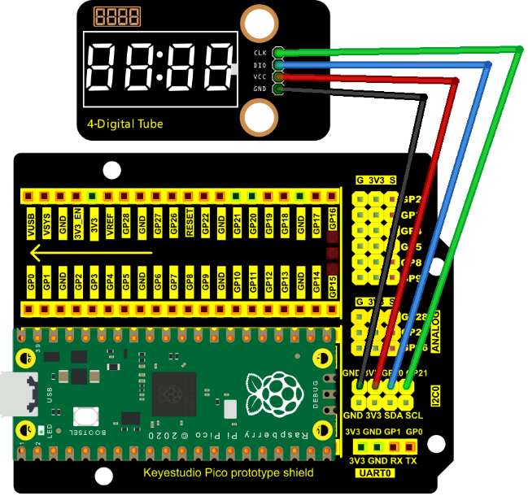
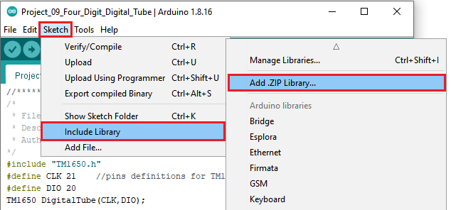
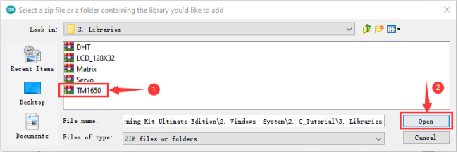
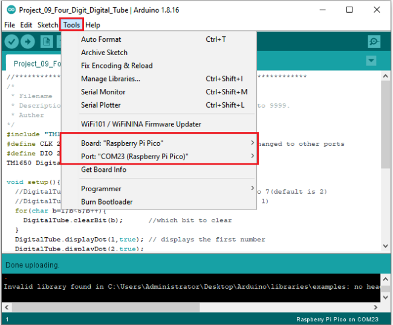
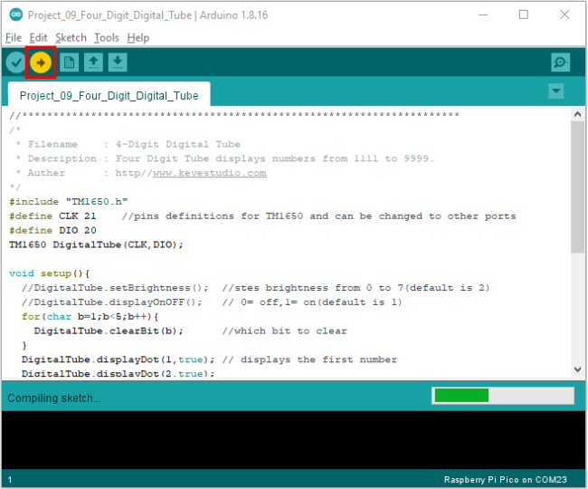
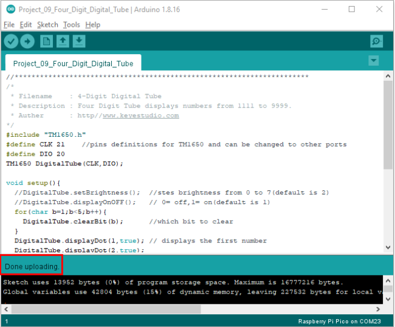

# Project 09：4-Digit Digital Tube

### **Introduction**

The 4-digit 7-segment digital tube is a very practical display device, and it is used for devices such as electronic clocks and score counters. Due to the low price and it is easy to use, more and more projects will use 4-digit 7-segment digital tubes. In this project, we will use the PLUS control board to control a 4-bit 7-segment digital tube to create a manual counter.

### **Components Required**



### **Component Knowledge**



**TM1650 4-digit digital tube**

It is a 12-pin 4-digit tube display module with clock dots. The driver chip is TM1650 which only needs 2 signal lines to enable the microcontroller to control the 4-digit 8-segment digital tube. The control interface level can be 5V or 3.3V.

**Specifications of 4-bit digital tube module:**

Working voltage: DC 3.3V-5V

Maximum current: 100MA

Maximum power: 0.5W

**Schematic diagram of 4-digit digital tube module:**



### **Wiring Diagram**





### **Adding the TM1650 library**

If you added the **TM1650 library, just skip this step.**

**Add the library as follows:**

Open Arduino IDE，click“Sketch”→“Include Library”→“Add .zip Library...”. Go to the folder KS3026 Keyestudio Raspberry Pi Pico Learning Kit Basic Edition\2. Windows  System\2. C_Tutorial\3. Libraries\TM1650.Zip and click TM1650.Zip and Open.





### **Test Code:**

Go to the folder KS3020 Keyestudio Raspberry Pi Pico Learning Kit Ultimate Edition\2. Windows  System\2. C_Tutorial\2. Projects\Project 09：4-Digit Digital Tube\Project_09_Four_Digit_Digital_Tube.

```c
//**********************************************************************
/* 
 * Filename    : 4-Digit Digital Tube
 * Description : Four Digit Tube displays numbers from 1111 to 9999.
 * Auther      : http//www.keyestudio.com
*/
#include "TM1650.h"
#define CLK 21    //pins definitions for TM1650 and can be changed to other ports 
#define DIO 20
TM1650 DigitalTube(CLK,DIO);

void setup(){
  //DigitalTube.setBrightness();  //stes brightness from 0 to 7(default is 2)
  //DigitalTube.displayOnOFF();   // 0= off,1= on(default is 1)
  for(char b=1;b<5;b++){
    DigitalTube.clearBit(b);      //which bit to clear
  }
  DigitalTube.displayDot(1,true); // displays the first number
  DigitalTube.displayDot(2,true);
  DigitalTube.displayDot(3,true);
  DigitalTube.displayDot(4,true);
  DigitalTube.displayBit(3,0);    //which number to display. bit=1-4, number=0-9
}

void loop(){
  for(int num=0; num<10; num++){
    DigitalTube.displayBit(1,num);
    DigitalTube.displayBit(2,num);
    DigitalTube.displayBit(3,num);
    DigitalTube.displayBit(4,num);
    delay(1000);
  }  
 }
//**********************************************************************************
```


Before uploading Test Code to Raspberry Pi Pico, please check the configuration of Arduino IDE.

Click "Tools" to confirm that the board type and ports.



Click  to upload the test code to the Raspberry Pi Pico board.





### **Result**

Upload the project code, wire up and power on, 4-digit digital tube circularly displays numbers from 0000 to 9999.
