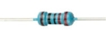

# Project 11：74HC595N Control 8 LEDs 

### **Introduction**

For a PLUS mainboard, it has only 22 I/O ports, how do we light up a large number of LEDs? In this project, we will use 74HC595N to control 7 LEDs to save port resources.

### **Components Required**

|  |  |  |  |
| ---------------------- | ------------------------------------- | ---------------------- | ---------------------- |
| Raspberry Pi Pico*1    | Raspberry Pi Pico Expansion Board*1   | 74HC595N Chip*1        | Red LED*8              |
|  |                 |  |  |
| 220Ω Resistor*8        | Breadboard*1                          | Jumper Wires           | USB Cable*1            |

**74HC595N Chip:** 

To put it simply, 74HC595N chip is a combination of 8-digit shifting register, memorizer and equipped with tri-state output. The shift register and the memorizer are synchronized to different clocks, and the data is input on the rising edge of the shift register clock SCK and goes into the memory register on the rising edge of the memory register clock RCK. If the two clocks are connected together, the shift register is always one pulse earlier than the storage register. The shift register has a serial shift input (SI) and a serial output (SQH) for cascading. The 8-bit shift register can be reset asynchronously (low-level reset), and the storage register has an 8-bit Three-state parallel bus output, when the output enable (OE) is enabled (active low), the storage register is output to the 74HC595N pin (bus).


**Pins**：

|             PIN             | FUNCTION                                                     |
| :-------------------------: | ------------------------------------------------------------ |
|          Pin13 OE           | It is an output enable pin to ensure that the data of the latch is input to the Q0 to Q7 pins or not. <br />When it is low, no high level is output. <br />In this experiment, we directly connect to GND and keep the data output low. |
|          Pin14 SI           | This is the pin for 74HC595 to receive data, <br />i.e. serial data input, only one bit can be input at a time, then 8 times in a row, it can form a byte. |
|         Pin10 SCLR          | A pin to initialize the storage register pins. <br />It initializes the internal storage registers at a low level. <br />In this experiment, we connect VCC to maintain a high level. |
|          Pin11 SCK          | The clock pin of the shift register. <br />At the rising edge, the data in the shift register is shifted backward as a whole, <br />and new data input is received. |
|          Pin12 RCK          | The clock input pin of the storage register . <br />At the rising edge, the data is transferred from the shift register to the storage register. <br />At this time, the data is output in parallel from the Q0 to Q7 ports. |
|          Pin9 SQH           | It is a serial output pin dedicated for chip cascading to the SI terminal of the next 74HC595. |
| Q0--Q7<br />(Pin 15,Pin1-7) | Eight-bit parallel output, can directly control the 8 segments of the digital tube. |

VCC and GND are used used for chip power supply, and the operating voltage is 5V.

### **Circuit Diagram and Wiring Diagram**


Note: Pay attention to the direction in which the 74HC595N chip is inserted.


### **Test Code**

You can open the code we provide:

Go to the folder KS3026 Keyestudio Raspberry Pi Pico Learning Kit Basic Edition\\2. Windows System\\2. C\_Tutorial\\2. Projects\\Project 11：74HC595N Control 8 LEDs\\Project\_11\_74HC595N\_Control\_8\_LEDs.

```c
//**********************************************************************
/* 
 * Filename    : 74HC595N Control 8 LEDs
 * Description : Use 74HC575N to drive ten leds to display the flowing light.
 * Auther      : http//www.keyestudio.com
*/
int dataPin = 18;   // Pin connected to DS of 74HC595(Pin14)  
int latchPin = 20;  // Pin connected to ST_CP of 74HC595(Pin12)
int clockPin = 21;  // Pin connected to SH_CP of 74HC595(Pin11)          

void setup() { // set pins to output
  pinMode(latchPin, OUTPUT);
  pinMode(clockPin, OUTPUT);
  pinMode(dataPin, OUTPUT);
}

void loop() {
  // Define a one-byte variable to use the 8 bits to represent the state of 8 LEDs of LED bar graph.
  // This variable is assigned to 0x01, that is binary 00000001, which indicates only one LED light on.
  byte x = 0x01;    // 0b 0000 0001
  for (int j = 0; j < 8; j++) { // Let led light up from right to left
    writeTo595(LSBFIRST, x);
    x <<= 1; // make the variable move one bit to left once, then the bright LED move one step to the left once.
    delay(100);
  }
  delay(100);
  x = 0x80;       //0b 1000 0000
  for (int j = 0; j < 8; j++) { // Let led light up from left to right
    writeTo595(LSBFIRST, x);
    x >>= 1;    
    delay(100);
  }
  delay(100);
}
void writeTo595(BitOrder order, byte _data ) {
  // Output low level to latchPin
  digitalWrite(latchPin, LOW);
  // Send serial data to 74HC595
  shiftOut(dataPin, clockPin, order, _data);
  // Output high level to latchPin, and 74HC595 will update the data to the parallel output port.
  digitalWrite(latchPin, HIGH);
}
//**********************************************************************************
```

Before uploading Test Code to Raspberry Pi Pico, please check the configuration of Arduino IDE.

Click "Tools" to confirm that the board type and ports.


Click  to upload the test code to the Raspberry Pi Pico board.


### **Result**

Upload project code, wire up and power on, then you can see 8 LED flash like a flowing light.
