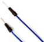

# Project 12：Active Buzzer

### **Introduction**

Active buzzer is a sound making element, widely used on computers, printers, alarms, electronic toys, telephones, timers, etc. It has an inner vibration source. In this project, we will use a PLUS control board to control the active buzzer to buzz.

### **Components Required**

|  |  |  |
| ------------------------------------------------------- | ------------------------------------ | ---------------------- |
| Raspberry Pi Pico\*1                                    | Raspberry Pi Pico Expansion Board\*1 | USB Cable\*1 |
|  |||
| Active Buzzer\*1                                        | Breadboard \*1                       | Jumper Wires           |

### **Component Knowledge**


The active buzzer inside has a simple oscillator circuit which can convert constant direct current into a certain frequency pulse signal. Once active buzzer receives a high level, it will sound. The passive buzzer is an integrated electronic buzzer with no internal vibration source. It must be driven by 2K to 5K square wave instead of a DC signal. The appearance of the two buzzers is very similar, but passive buzzers come with a green circuit board, and active buzzers come with a black tape. Passive buzzers don't have positive pole, but active buzzers have.


### **Circuit Diagram and Wiring Diagram**


Note:

1.  The power supply of the buzzer is 5V. With a 3.3V supply, the buzzer will work, but it will beep weakly.

2.  VUSB should be connected to the positive side of the USB cable, if it is connected to GND, it may burn out the computer or Raspberry Pi Pico. Also, be careful when wiring the Raspberry Pi Pico pins 36-40 to avoid short circuits.


3. The positive pole (“+”/long pin) of the active buzzer is connected to pin 16, and the negative pole (short pin) is connected to GND.

### **Test Code**

You can open the code we provide:

Go to the folder KS3026 Keyestudio Raspberry Pi Pico Learning Kit Basic Edition\\2. Windows System\\2. C\_Tutorial\\2. Projects\\Project 12：Active Buzzer\\Project\_12\_Active\_Buzzer

```C
//**********************************************************************
/* 
 * Filename    : Active Buzzer
 * Description : Active buzzer beeps.
 * Auther      : http//www.keyestudio.com
*/
#define buzzerPin  16   //define buzzer pins

void setup ()
{
  pinMode (buzzerPin, OUTPUT);
}
void loop ()
{
  digitalWrite (buzzerPin, HIGH);
  delay (500);
  digitalWrite (buzzerPin, LOW);
  delay (500);
}
//*************************************************************************
```


Before uploading Test Code to Raspberry Pi Pico, please check the configuration of Arduino IDE.

Click "Tools" to confirm that the board type and ports.


Click  to upload the test code to the Raspberry Pi Pico board.


### **Result**

Upload the project code, wire up and power up, then the active buzzer buzzes.
