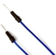
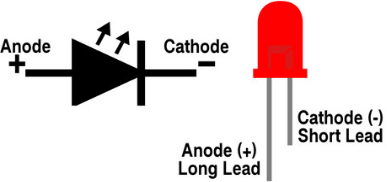

# Project 14: Mini Table Lamp

### **Introduction**

Did you know that Arduino can light up an LED when you press a button? In this project, we will use the Plus Mainboard, a key switch and an LED to make a small desk lamp.

### **Components Required**

|                 |  |  |  |  |
| ------------------------------------- | ------------------------------------- | ------------------------------------- | ------------------------------------- | ------------------------------------- |
| Raspberry Pi Pico*1                   | Raspberry Pi Pico Expansion Board*1   | Button*1                              | Red LED*1                             | 10KΩ Resistor*1                       |
|  |                 |                |                |                |
| Breadboard*1                          | 220Ω Resistor*1                       | USB Cable*1                           | Jumper Wires                          | Button Cap*1                          |

### **Component Knowledge**


**Button:** 

The button can control the circuit on and off. The circuit is disconnected when the button is not pressed. But it breaks when you release it. Why does it only work when you press it? It starts from the internal structure of the button:. 

Before the button is pressed, 1 and 2 are on, 3 and 4 are also on, but 1, 3 or 1, 4 or 2, 3 or 2, 4 are off (not working). Only when the button is pressed, 1, 3 or 1, 4 or 2, 3 or 2, 4 are on.

The key switch is one of the most commonly used components in circuit design.

**Schematic diagram of the button:**


### **Circuit Diagram and Wiring Diagram**


**Note:**

How to connect the LED



How to identify the 220Ω 5-band resistor and 10KΩ 5-band resistor


### **Test Code：**

You can open the code we provide:

Go to the folder KS3026 Keyestudio Raspberry Pi Pico Learning Kit Basic Edition\\2. Windows System\\2. C\_Tutorial\\2. Projects\\Project 14：Mini Table Lamp\\Project\_14\_Mini\_Table\_Lamp.

```c
//**********************************************************************
/* 
 * Filename    : Mini Table Lamp
 * Description : Make a table lamp.
 * Auther      : http//www.keyestudio.com
*/
#define PIN_LED    19
#define PIN_BUTTON 22
bool ledState = false;

void setup() {
  // initialize digital pin PIN_LED as an output.
  pinMode(PIN_LED, OUTPUT);
  pinMode(PIN_BUTTON, INPUT);
}

// the loop function runs over and over again forever
void loop() {
  if (digitalRead(PIN_BUTTON) == LOW) {
    delay(20);
    if (digitalRead(PIN_BUTTON) == LOW) {
      reverseGPIO(PIN_LED);
    }
    while (digitalRead(PIN_BUTTON) == LOW);
  }
}

void reverseGPIO(int pin) {
  ledState = !ledState;
  digitalWrite(pin, ledState);
}
//**********************************************************************
```


Before uploading Test Code to Raspberry Pi Pico, please check the configuration of Arduino IDE.

Click "Tools" to confirm that the board type and ports.


Click  to upload the test code to the Raspberry Pi Pico board


### **Result**

Burn the project code, connect the wires and power on first. Then press the button, the LED will turn on. Press the button again, the LED will turn off.
