# Project 18: Dimming Light

### **Introduction**

A potentiometer is a three-terminal resistor with a sliding or rotating contact that forms an adjustable voltage divider. It works by varying the position of a sliding contact across a uniform resistance. In a potentiometer, the entire input voltage is applied across the whole length of the resistor, and the output voltage is the voltage drop between the fixed and sliding contact. 

In this project, we are going to learn how to use Arduino to read the values of the potentiometer, and make a dimming lamp.

### **Components Required**

|  |              |  |  |
| ----------------------- | ----------------------------------- | ----------------------- | ----------------------- |
| Raspberry Pi Pico*1     | Raspberry Pi Pico Expansion Board*1 | Potentiometer*1         | Red LED*1               |
|  |              |  |  |
| Breadboard*1            | 200Ω Resistor*1                     | Jumper Wires            | USB Cable*1             |

### **Component Knowledge**

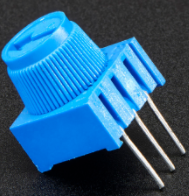

**Adjustable potentiometer:** 

It is a kind of resistor and an analog electronic component, which has two states of 0 and 1(high level and low level). The analog quantity is different, its data state presents a linear state such as 0 to 1023.

### **Read the Potentiometer Value**

We connect the adjustable potentiometer to the analog pin of Arduino to read its value. Please refer to the following wiring diagram for wiring.

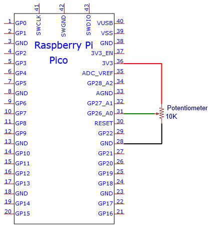

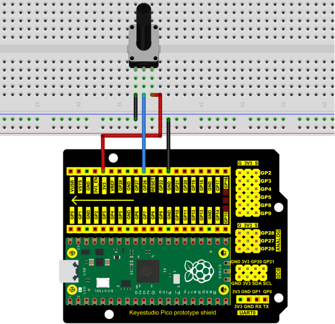

You can open the code we provide:

Go to the folder KS3026 Keyestudio Raspberry Pi Pico Learning Kit Basic Edition\2. Windows  System\2. C_Tutorial\2. Projects\Project 18：Dimming Light\Project_18.1_Read_Potentiometer_Analog_Value.

```c
//**********************************************************************************
/*  
 * Filename    : Read Potentiometer Analog Value
 * Description : Basic usage of ADC
 * Auther      : http//www.keyestudio.com
*/
#define PIN_ANALOG_IN  26  //the pin of the Potentiometer

void setup() {
  Serial.begin(115200);
}

//In loop() function, analogRead is called to get the ADC value of ADC0 and assign it to adcVal. 
//Calculate the measured voltage value through the formula, and print these data through the serial port monitor.
void loop() {
  int adcVal = analogRead(PIN_ANALOG_IN);
  double voltage = adcVal / 1023.0 * 3.3;
  Serial.println("ADC Value: " + String(adcVal) + " --- Voltage Value: " + String(voltage) + "V");
  delay(500);
}
//**********************************************************************************
```


Before uploading Test Code to Raspberry Pi Pico, please check the configuration of Arduino IDE.

Click "Tools" to confirm that the board type and ports.

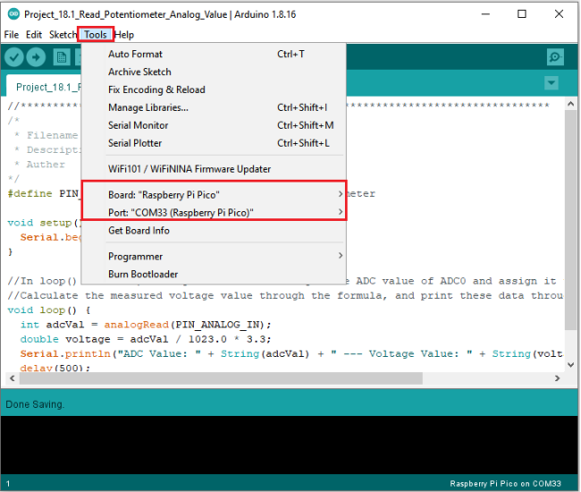

Click  to upload the test code to the Raspberry Pi Pico board.

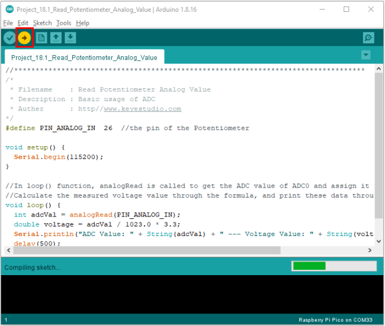

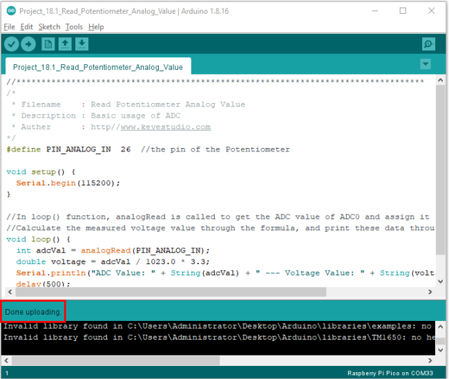

Upload the code , connect the wires and power on first. Then open the serial monitor, set the baud rate to 115200. The serial monitor window will print out the ADC value and voltage value of the potentiometer. When moving the knob of the potentiometer is turned, the ADC value and voltage value will change. As shown below:

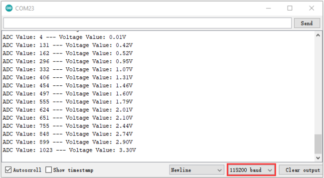

### **Circuit diagram and wiring diagram**

In the previous step, we read the ADC value and voltage value of the potentiometer. Then we need to convert the ADC value into the brightness of the LED to make a light with adjustable brightness. 

As shown below:

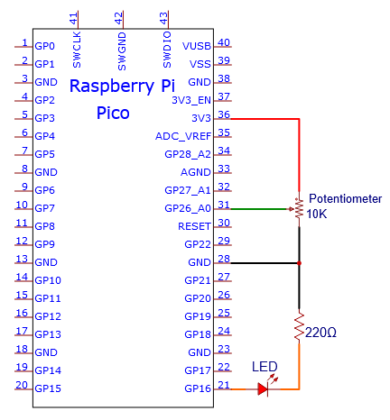

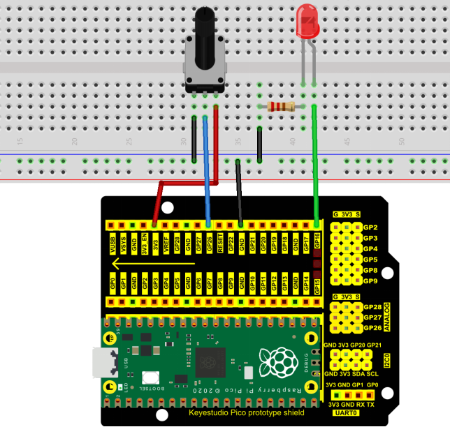

### **Test Code**

You can open the code we provide:

Go to the folder KS3026 Keyestudio Raspberry Pi Pico Learning Kit Basic Edition\2. Windows  System\2. C_Tutorial\2. Projects\Project 18：Dimming Light\Project_18.2_Dimming_Light

```c
//**********************************************************************************
/*  
 * Filename    : Dimming Light
 * Description : Controlling the brightness of LED by potentiometer.
 * Auther      : http//www.keyestudio.com
*/
#define PIN_ADC0    26  //the pin of the potentiometer
#define PIN_LED     16  // the pin of the LED

void setup() {
  pinMode(PIN_LED, OUTPUT);
  pinMode(PIN_ADC0, INPUT);
}

void loop() {
  int adcVal = analogRead(PIN_ADC0); //read the ADC value of potentiometer
  analogWrite(PIN_LED, map(adcVal, 0, 1023, 0, 255));//map ADC to the duty cycle of PWM to control LED brightness.
  delay(10);
}
//*********************************************************************************
```


Before uploading Test Code to Raspberry Pi Pico, please check the configuration of Arduino IDE.

Click "Tools" to confirm that the board type and ports.

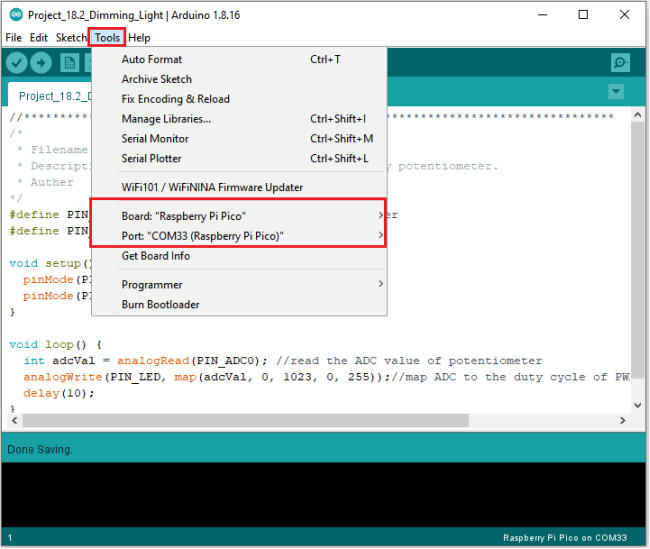

Click  to upload the test code to the Raspberry Pi Pico board.

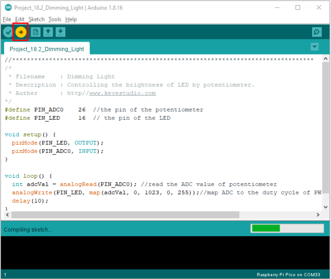

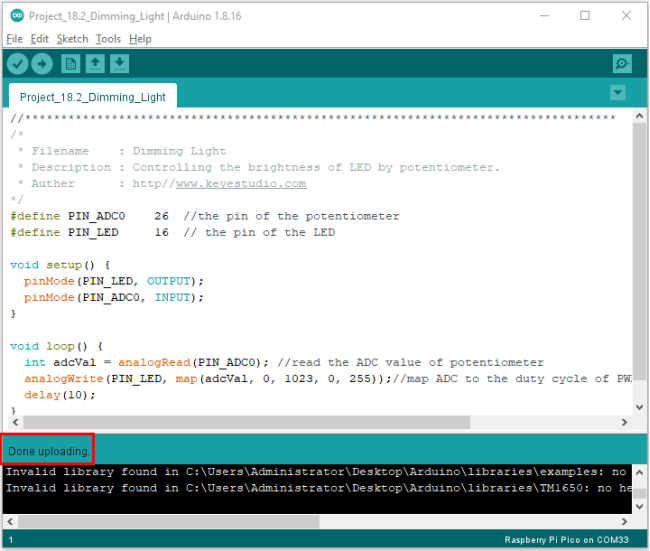

### **Test Result**

Upload the code to Raspberry Pi Pico, change the input voltage of GP26 by turning the potentiometer.

Raspberry Pi Pico changes the output voltage of GP16 according to this voltage value, thereby changing the brightness of the LED.

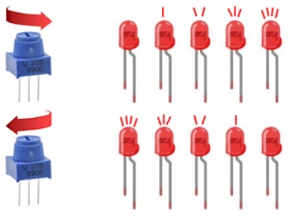
