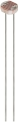

# Project 20：Night Lamp

### **Introduction**

Sensors or components are ubiquitous in our daily life. For example, some public street lights turn on automatically at night and turn off automatically during the day. 

Why? In fact, this make use of a photosensitive element that senses the intensity of external ambient light. When the outdoor brightness decreases at night, the street lights will automatically turn on. In the daytime, the street lights will automatically turn off. The principle of this is very simple. 

In this lesson we will use  Raspberry Pi Pico to control LEDs to implement the function of this street light.

### **Components Required**

|  |              |  |
| ----------------------- | ----------------------------------- | ----------------------- |
| Raspberry Pi Pico*1     | Raspberry Pi Pico Expansion Board*1 | Photoresistor*1         |
|  |              |  |
| Breadboard*1            | 220ΩResistor*1                      | Jumper Wires            |
|  |              |  |
| Red LED*1               | 10KΩResistor*1                      | USB Cable*1             |

### **Component Knowledge**


It is a photosensitive resistor, its principle is that the photoresistor surface receives brightness (light) to reduce the resistance. The resistance value will change with the detected intensity of the ambient light . With this property, we can use photoresistors to detect light intensity. Photoresistors and other electronic symbols are as follows:  


The following circuit is used to detect changes in resistance values of photoresistors:


In the circuit above, when the resistance of the photoresistor changes due to the change of light intensity, the voltage between the photoresistor and resistance R2 will also change. Thus, the intensity of light can be obtained by measuring this voltage.

### **Read the Analog Value**

We first use a simple code to read the value of the photoresistor, print it in the serial monitor. For wiring, please refer to the following wiring diagram.


### **Test Code**

Go to the folder KS3026 Keyestudio Raspberry Pi Pico Learning Kit Basic Edition\2. Windows  System\2. C_Tutorial\2. Projects\Project 20：Night Lamp\Project_20.1_Read_Photosensitive_Analog_Value.

```c
//**********************************************************************************
/*  
 * Filename    : Read Photosensitive Analog Value
 * Description : Basic usage of ADC
 * Auther      : http//www.keyestudio.com
*/
#define PIN_ANALOG_IN  26  //the pin of the photosensitive sensor

void setup() {
  Serial.begin(115200);
}

//In loop() function, analogRead is called to get the ADC value of ADC0 and assign it to adcVal. 
//Calculate the measured voltage value through the formula, and print these data through the serial port monitor.
void loop() {
  int adcVal = analogRead(PIN_ANALOG_IN);
  double voltage = adcVal / 1023.0 * 3.3;
  Serial.println("ADC Value: " + String(adcVal) + " --- Voltage Value: " + String(voltage) + "V");
  delay(500);
}
//*********************************************************************************
```


Before uploading Test Code to Raspberry Pi Pico, please check the configuration of Arduino IDE.

Click "Tools" to confirm that the board type and ports.


Click  to upload the test code to the Raspberry Pi Pico board.


Upload the code to the Pico board, wire up and power up, open the serial monitor and set the baud rate to 115200. Then you can read the analog value of photoresistor. When the light intensity around the sensor gets dim, the analog value displayed on the serial monitor will gradually reduce. On the contrary, the analog value will gradually increase.


### **Circuit Diagram and Wiring Diagram**

Next, we make a light-control lamp.

The Raspberry Pi Pico takes the analog value of the sensor and then adjusts the brightness of the LED.


You can open the code we provide:

Go to the folder KS3026 Keyestudio Raspberry Pi Pico Learning Kit Basic Edition\\2. Windows System\\2. C\_Tutorial\\2. Projects\\Project 20：Night Lamp\\Project\_20.2\_Night\_Lamp.

```c
//**********************************************************************************
/*  
 * Filename    : Night Lamp
 * Description : Controlling the brightness of LED by photosensitive sensor.
 * Auther      : http//www.keyestudio.com
*/
#define PIN_ADC0    26  // the pin of the photosensitive sensor
#define PIN_LED     16  // the pin of the LED

void setup() {
  pinMode(PIN_LED, OUTPUT);
  pinMode(PIN_ADC0, INPUT);
}

void loop() {
  int adcVal = analogRead(PIN_ADC0); //read the ADC value of photosensitive sensor
  analogWrite(PIN_LED, map(adcVal, 0, 1023, 0, 255));//map ADC to the duty cycle of PWM to control LED brightness.
  delay(10);
}
//********************************************************************************
```


Before uploading Test Code to Raspberry Pi Pico, please check the configuration of Arduino IDE.

Click "Tools" to confirm that the board type and ports.


Click  to upload the test code to the Raspberry Pi Pico board.


### **Test Results**

After the project code is uploaded successfully and power up. when the light intensity gets weak, the LED will becomes brighter; otherwise, the LED will become darker.


