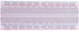
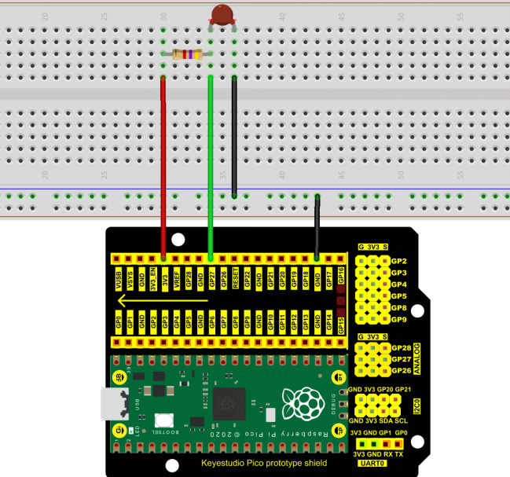
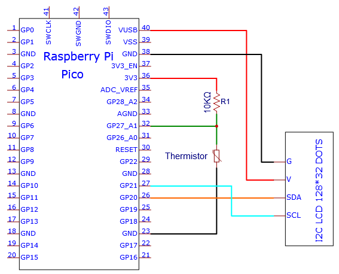
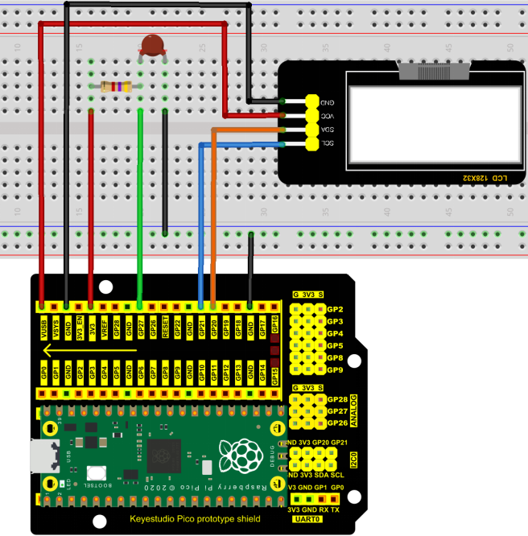

# Project 21：Temperature Instrument

### **Introduction**

LM35 is a commonly used and easy-to-use temperature sensor. It does not require other hardware, only needs an analog port. The difficulty lies in compiling the code and converting the analog values to Celsius temperature. 

In this project, we use a temperature sensor and 3 LEDs to make a temperature tester. When the temperature sensor touches objects with different temperature, the LED will show different colors.

### **Components Required**

|  |              |  |
| ----------------------- | ----------------------------------- | ----------------------- |
| Raspberry Pi Pico*1     | Raspberry Pi Pico Expansion Board*1 | Photoresistor*1         |
|  |              |  |
| 10CMM-F Dupont Wires    | Breadboard*1                        | LCD 128X32 DOT*1        |
|  |              |  |
| 10KΩ Resistor*1         | USB Cable*1                         | Jumper Wires            |

### **Component Knowledge**

**Thermistor**

A thermistor is a temperature sensitive resistor. When it senses a change in temperature, the thermistor's resistance changes. We can use this feature to detect temperature intensity with thermistor. Thermistors and its electronic symbols are shown below:


The relation between thermistor resistance and temperature is:


**Rt** is the resistance of the thermistor at T2 temperature.

**R** is the nominal resistance value of the thermistor at T1 room temperature.

**EXP\[n\]** is the nth power of e.

**B** is the temperature index

**T1** and **T2** refer to K degrees, that is, Kelvin temperature. Kelvin temperature =273.15 + Celsius temperature. 

For thermistor parameters, we use: B=3950, R=10KΩ，T1=25℃.

The circuit connection method of thermistor is similar to that the photoresistor, as shown below :


We can use the value measured by the ADC converter to get the resistance value of the thermistor, and then use the formula to get the temperature value. Therefore, the temperature formula can be deduced as:


### **Read the Values**

First we will learn the thermistor to read the current ADC value, voltage value and temperature value and print them out . Please connect the wires according to the following wiring diagram.




You can open the code we provide:

Go to the folder KS3026 Keyestudio Raspberry Pi Pico Learning Kit  Basic Edition\2. Windows  System\2. C_Tutorial\2. Projects\Project 21：Temperature Instrument\Project_21.1_Read_the_thermistor_analog_value.

```c
//**********************************************************************************
/*  
 * Filename    : Read the thermistor analog value
 * Description : Making a thermometer by thermistor.
 * Auther      : http//www.keyestudio.com
*/
#define PIN_ADC1   27
void setup() {
  Serial.begin(115200);
}

void loop() {
  int adcValue = analogRead(PIN_ADC1);                            //read ADC pin
  double voltage = (float)adcValue / 1023.0 * 3.3;                // calculate voltage
  double Rt = 10 * voltage / (3.3 - voltage);                     //calculate resistance value of thermistor
  double tempK = 1 / (1 / (273.15 + 25) + log(Rt / 10) / 3950.0); //calculate temperature (Kelvin)
  double tempC = tempK - 273.15;                                  //calculate temperature (Celsius)
  Serial.println("Voltage: " + String(voltage) + "V,\t\t" + "Kelvins: " + String(tempK) + "K,\t" + "Temperature: " + String(tempC) + "C");
  delay(1000);
}
//**********************************************************************************
```


Before uploading Test Code to Raspberry Pi Pico, please check the configuration of Arduino IDE.

Click "Tools" to confirm that the board type and ports.


Click  to upload the test code to the Raspberry Pi Pico board.


Upload the code to the Raspberry Pi Pico successfully, power up with a USB cable, open the serial monitor and set the baud rate to 115200.

The serial monitor will display the current ADC value, voltage value and temperature value of the thermistor. Press the photoresistor, the temperature value will rise.


Circuit diagram and wiring diagram:

Note: You must use a 10CM M-F DuPont wire to connect LCD\_128X32\_DOT,then LCD\_128X32\_DOT will display normally;

A 20CM long male-to-female DuPont cable is not required because the LCD\_128X32\_DOT display abnormally.





### **Adding the lcd128\_32\_io library**

If you added the **lcd128\_32\_io library, just skip this step.**

**Add the library as follows:**

Open Arduino IDE，click “Sketch”→“Include Library”→“Add .zip Library...”. Go to the folder KS3026 Keyestudio Raspberry Pi Pico Learning Kit  Basic Edition\2. Windows  System\2. C_Tutorial\3. Libraries\LCD_128X32.Zip，click LCD_128X32.Zip then“Open”


### **Test Code**

You can open the code we provide:

Go to the folder KS3026 Keyestudio Raspberry Pi Pico Learning Kit  Basic Edition\2. Windows  System\2. C_Tutorial\2. Projects\Project 21：Temperature Instrument\Project_21.2_Temperature_Instrument.

```
//**********************************************************************************
/*  
 * Filename    : Temperature Instrument
 * Description : LCD displays the temperature of thermistor.
 * Auther      : http//www.keyestudio.com
*/
#include "lcd128_32_io.h"

#define PIN_ADC1  27

lcd lcd(20, 21); //Create lCD128 *32 pin，sda->20， scl->21

void setup()  {
  lcd.Init(); //initialize
  lcd.Clear();  //clear
}
char string[10];

void loop() {
  int adcValue = analogRead(PIN_ADC1);                            //read ADC pin
  double voltage = (float)adcValue / 1023.0 * 3.3;                // calculate voltage
  double Rt = 10 * voltage / (3.3 - voltage);                     //calculate resistance value of thermistor
  double tempK = 1 / (1 / (273.15 + 25) + log(Rt / 10) / 3950.0); //calculate temperature (Kelvin)
  double tempC = tempK - 273.15;                                  //calculate temperature (Celsius)
  lcd.Cursor(0,0); //Set display position
  lcd.Display("Voltage:"); //Setting the display
  lcd.Cursor(0,8);
  lcd.DisplayNum(voltage);
  lcd.Cursor(0,11);
  lcd.Display("V");
  lcd.Cursor(2,0); 
  lcd.Display("tempC:");
  lcd.Cursor(2,8);
  lcd.DisplayNum(tempC);
  lcd.Cursor(2,11);
  lcd.Display("C");
  delay(200);
}
//********************************************************************************
```


Before uploading Test Code to Raspberry Pi Pico, please check the configuration of Arduino IDE.

Click "Tools" to confirm that the board type and ports.


Click  to upload the test code to the Raspberry Pi Pico board.


### **Test Result**

Upload the code and power up with a USB cable. The LCD 128X32 DOT will show the voltage value and temperature value.


